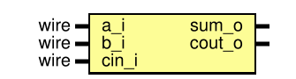

# Entity: full_adder 
- **File**: full_adder.sv
- **Title:**  Full Adder
- **Author:**  Kyle Ringor

## Diagram

## Description

One-bit combinational full adder used as the primitive for the structural adder chain.

## Ports

| Port name | Direction | Type | Description  |
| --------- | --------- | ---- | ------------ |
| a_i       | input     | wire | First input  |
| b_i       | input     | wire | Second input |
| cin_i     | input     | wire | Carry in     |
| sum_o     | output    |      | Sum          |
| cout_o    | output    |      | Carry out    |
