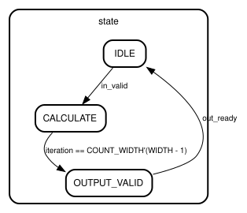

# Entity: shift_add_multiplier 
- **File**: shift_add_multiplier.sv
- **Title:**  Signed Shift-and-Add Multiplier
- **Author:**  Kyle Ringor

## Diagram

## Description

A reusable signed multiplier that accepts one transaction through a ready/valid input,
performs one unsigned-magnitude radix-2 iteration per cycle, and returns the exact signed
double-width product. The output remains valid and stable until it is accepted. A new input
is accepted no earlier than the cycle after the preceding output transfer.

## Generics

| Generic name | Type         | Value | Description |
| ------------ | ------------ | ----- | ----------- |
| WIDTH        | int unsigned | 32    |             |

## Ports

| Port name | Direction | Type                      | Description                          |
| --------- | --------- | ------------------------- | ------------------------------------ |
| clk       | input     | wire                      | Clock                                |
| rst       | input     | wire                      | Synchronous active-high reset        |
| in_valid  | input     | wire                      | Input operands are valid             |
| in_ready  | output    |                           | Core can accept an input transaction |
| operand_a | input     | wire signed [WIDTH - 1:0] | First signed integer operand         |
| operand_b | input     | wire signed [WIDTH - 1:0] | Second signed integer operand        |
| out_valid | output    |                           | Exact product is valid               |
| out_ready | input     | wire                      | Consumer can accept the product      |
| product   | output    | [(2 * WIDTH) - 1:0]       | Exact signed product                 |

## Signals

| Name            | Type                        | Description |
| --------------- | --------------------------- | ----------- |
| iteration       | logic [COUNT_WIDTH - 1:0]   |             |
| result_negative | logic                       |             |
| accumulator     | logic [PRODUCT_WIDTH - 1:0] |             |
| multiplicand    | logic [PRODUCT_WIDTH - 1:0] |             |
| multiplier      | logic [WIDTH - 1:0]         |             |
| addend          | logic [PRODUCT_WIDTH - 1:0] |             |
| adder_sum       | logic [PRODUCT_WIDTH - 1:0] |             |
| adder_carry     | logic                       |             |
| magnitude_a     | logic [WIDTH - 1:0]         |             |
| magnitude_b     | logic [WIDTH - 1:0]         |             |

## Constants

| Name          | Type | Value                          | Description |
| ------------- | ---- | ------------------------------ | ----------- |
| PRODUCT_WIDTH |      | 2 * WIDTH                      |             |
| COUNT_WIDTH   |      | (WIDTH > 1) ? clog2(WIDTH) : 1 |             |

## Types

| Name    | Type                                                                                                                                                                                       | Description |
| ------- | ------------------------------------------------------------------------------------------------------------------------------------------------------------------------------------------ | ----------- |
| state_t | enum logic [1:0] {          IDLE,          CALCULATE,          OUTPUT_VALID     } |             |

## Processes
- unnamed: ( @(posedge clk) )
  - **Type:** always_ff

## Instantiations

- u_accumulator_adder: ripple_carry_adder

## State machines

